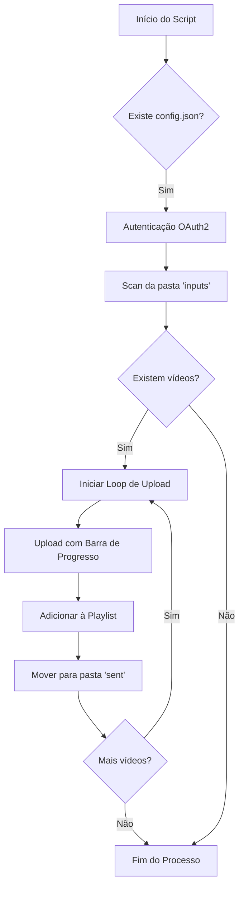

# YouTube Auto Uploader


---

Uma ferramenta de automação CLI (Command Line Interface) robusta para realizar uploads em massa de vídeos para o YouTube, com suporte a playlists e organização automática de arquivos.

---

## 📜 Sobre o Projeto

O processo de upload manual de vídeos — preencher títulos, descrições, selecionar tags e esperar o processamento — consome um tempo valioso de qualquer criador de conteúdo. Este projeto foi desenvolvido para eliminar esse gargalo. Utilizando a YouTube Data API v3, o script processa uma pasta inteira de vídeos sequencialmente, realiza o upload com barra de progresso em tempo real, adiciona-os à playlist correta e organiza os arquivos locais, transformando horas de trabalho manual em um único comando.

## ✨ Funcionalidades Principais

-   🔄 **Upload em Massa:** Varre a pasta de entrada e processa todos os vídeos (`.mp4`, `.mov`, `.mkv`, etc.) automaticamente.
-   ⚙️ **Configuração Centralizada:** Títulos, tags, privacidade e categoria são gerenciados via `config.json`.
-   📑 **Gestão de Playlists:** Adiciona o vídeo recém-enviado diretamente a uma Playlist específica do canal.
-   ⏳ **Feedback Visual:** Barra de progresso em tempo real no terminal para acompanhar o envio de arquivos pesados.
-   🔐 **Autenticação Segura:** Implementa o fluxo OAuth 2.0 oficial do Google, garantindo segurança sem expor senhas.
-   🧹 **Organização Automática:** Move os arquivos processados para a pasta `sent/` após o sucesso, evitando duplicidade.
-   🚀 **Upload Resumível:** Envia arquivos em pedaços (chunks), tornando o processo estável mesmo em conexões instáveis.

## 🛠️ Tecnologias Utilizadas

| Tecnologia | Propósito |
| :--- | :--- |
| **Python 3** | Linguagem principal do script |
| **YouTube Data API v3** | Interação com os serviços de vídeo do Google |
| **Google Auth** | `google-auth-oauthlib` para autenticação OAuth2 |
| **Google API Client** | `google-api-python-client` para chamadas de API |
| **Git & GitHub** | Controle de versão e portfólio |

## 🏗️ Arquitetura e Fluxo de Execução

O fluxo foi desenhado para ser linear e à prova de falhas:



Nota: Na primeira execução, o script abrirá o navegador para que você autorize o aplicativo na sua conta do YouTube, gerando um token local para usos futuros.

## 🚀 Começando

Para rodar este projeto na sua máquina, siga os passos abaixo.

### Pré-requisitos

-   Python 3.9 ou superior
-   Git
-   Uma conta no Google/YouTube

### Instalação e Configuração

1.  **Clone o repositório:**
    ```bash
    git clone [https://github.com/anaritazevedo/youtube-uploader.git](https://github.com/anaritazevedo/youtube-uploader.git)
    cd youtube-uploader
    ```

2.  **Instale as dependências:**
    ```bash
    pip install -r requirements.txt
    ```

3.  **Configure as Credenciais do Google Cloud:**
    -   Acesse o [Google Cloud Console](https://console.cloud.google.com/).
    -   Crie um projeto e ative a **YouTube Data API v3**.
    -   Configure a "Tela de Consentimento OAuth" (Adicione seu e-mail em "Usuários de Teste").
    -   Crie credenciais de **ID do Cliente OAuth** (Tipo: Desktop App).
    -   Baixe o JSON, renomeie para `client_secrets.json` e coloque na raiz do projeto.

4.  **Configure o Arquivo `config.json`:**
    -   Edite o arquivo `config.json` (ou crie um baseado no exemplo):
        ```json
        {
            "category_id": "20",
            "privacy_status": "private",
            "tags": ["python", "automacao", "youtube"],
            "description_suffix": "\n\nPostado via Script Python.",
            "playlist_id": "SEU_ID_DA_PLAYLIST_AQUI"
        }
        ```

## 💻 Uso

Com os vídeos colocados na pasta `inputs`, execute o comando:

```bash
python main.py
```
O terminal exibirá o progresso de cada arquivo. Após o término, verifique seu canal no YouTube Studio.

├── .gitignore            # Protege suas credenciais de subirem pro GitHub

├── README.md             # Documentação do projeto

├── main.py               # O cérebro do uploader

├── config.json           # Suas preferências de vídeo

├── client_secrets.json   # (NÃO COMITAR) Sua chave de acesso

├── requirements.txt      # Dependências do Python

├── inputs/               # Pasta de origem dos vídeos

└── sent/                 # Pasta de destino (processados)

## 🤝 Como Contribuir

Contribuições são o que tornam a comunidade de código aberto um lugar incrível para aprender, inspirar e criar. Qualquer contribuição que você fizer será **muito apreciada**.

1.  Faça um Fork do Projeto
2.  Crie sua Feature Branch (`git checkout -b feature/NovaFeature`)
3.  Faça o Commit de suas alterações (`git commit -m 'Add: nova funcionalidade'`)
4.  Faça o Push para a Branch (`git push origin feature/NovaFeature`)
5.  Abra um Pull Request

## ⚖️ Licença

Distribuído sob a Licença MIT.

## 👤 Autora

**Ana Rita Azevedo**

-   [GitHub: @anaritazevedo](https://github.com/anaritazevedo)
-   [Linkedin: anaritazevedo](https://www.linkedin.com/in/anaritazevedo/)
